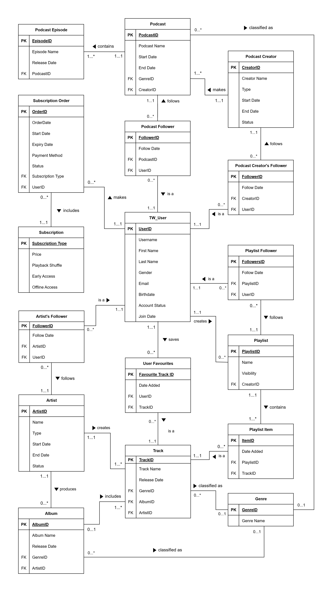

# TuneWave: Online Music & Podcast Streaming
TuneWave is an upcoming (fictional) online music & podcast streaming platform. The company behind it, has tasked us to design their database to support all their 
operations.

These are the company’s business rules:

• To access TuneWave, users must register an account by providing some basic information. 

• Users will have a free account by default, with limited features and they can purchase one of the available subscription plans to access much more.

• Each subscription tier unlocks an additional feature. The first tier includes a shuffle option. The second tier includes early access to newly released tracks & podcasts. The third tier offers users the option to download tracks and access them offline. 

• Each subscription will expire a year after its purchase.  

• Users can only use certain payment methods to purchase subscriptions. 

• All users are allowed to save their favourite tracks in a “Liked Tracks” playlist, which is only visible to them. 

• Users can create public or private customised playlists with any number of 
tracks. 

• Users can choose to follow public playlists and artists, so that they receive 
notifications when there is an update. 

• Music will be categorized according to the artist, album, and track name in 
the platform.  

• The platform will also offer podcasts. A podcast must have at least one 
episode & a podcast creator must have a podcast. 

• Users can choose to follow podcast creators or a podcast to receive 
notifications when there are updates. 

• Tracks & podcast may be classified by their genres if available. 

## Entities

<table cellspacing="0" cellpadding="5">
  <tr>
    <td align="center">User</td>
    <td align="center">User Favourite Item</td>
    <td align="center">Subscription</td>
    <td align="center">Subscription Order</td>
    <td align="center">Artist</td>
    <td align="center">Artist's Follower</td>
  </tr>
  <tr>
    <td align="center">Album</td>
    <td align="center">Track</td>
    <td align="center">Playlist</td>
    <td align="center">Playlist Follower</td>
    <td align="center">Playlist Item</td>
    <td align="center">Podcast</td>
  </tr>
  <tr>
    <td align="center">Podcast Episode</td>
    <td align="center">Podcast Creator</td>
    <td align="center">Podcast Creator Follower</td>
    <td align="center">Podcast Follower</td>
    <td align="center"> Genre</td>
  </tr>
</table>

## Entity Relationship Diagram

## Database Table Definitions

#### Table: TW_User

| Column Name | Constraints | Default Value | Data Type | Length |
|:---------:|:--------:|:---------:|:--------:|:---------:|
| UserID | Primary Key | - | Number | 6 |
| Username | Not Null, Unique | - | Varchar2 | 20 |
| FirstName | Not Null | - | Varchar2 | 50 |
| LastName | - | - | Varchar2 | 50 |
| Gender | Not Null, Check (Male, Female, or Unavailable) | Unavailable | Varchar2 | 11 |
| Email | Not Null, Unique | - | Varchar2 | 200 |
| Birthdate | Not Null | - | Date | - |
| AccStatus | Not Null, Check (Active, Inactive) | Active | Varchar2 | 8 |
| JoinDate | Not Null | SYSDATE | Date | - |

#### Table: Subscription

| Column Name | Constraints | Default Value | Data Type | Length |
|:---------:|:--------:|:---------:|:--------:|:---------:|
| SubType | Primary Key | - | Varchar2 | 6 |
| Price | - | - | Number | 4,2 |
| PlaybackShuffle | Check (True or False), Not Null | - | Varchar2 | 5 |
| EarlyAccess | Check (True or False), Not Null | - | Varchar2 | 5 |
| OfflineAccess | Check (True or False), Not Null | - | Varchar2 | 5 |

#### Table: SubscriptionOrder

| Column Name | Constraints | Default Value | Data Type | Length |
|:---------:|:--------:|:---------:|:--------:|:---------:|
| OrderID | Primary Key | - | Number | 5 |
| OrderDate | Not Null | SYSDATE | Date | - |
| StartDate | Check ((Status = 'Paid' AND StartDate IS NOT NULL) OR (Status != 'Paid' AND StartDate IS | - | ADD_MONTHS(StartDate,12) | Date | - |
| PaymentMethod | Check (Master, Visa, GIRO) | - | Varchar2  | 6 |
| Status | Check (Paid, Pending, Cancelled), Not Null | - | Varchar2 | 9 |
| SubType | Not Null, Foreign Key to Subscription table | - | Varchar2  | 6 |
| UserID | Not Null, Foreign Key to TW_User table | - | Number | 6 |

#### Table: Artist

| Column Name | Constraints | Default Value | Data Type | Length |
|:---------:|:--------:|:---------:|:--------:|:---------:|
| ArtistID | Primary Key | - | Number | 4 |
| Name | Not Null, Unique | - | Varchar2 | 50 |
| Type | Check (Solo or Group) | - | Varchar2 | 5 |
| StartDate | - | - | Date | - |
| EndDate | - | - | Date | - |
| Status  | Check (Active, Inactive) | - | Varchar2 | 8 |

#### Table: ArtistFollower

| Column Name | Constraints | Default Value | Data Type | Length |
|:---------:|:--------:|:---------:|:--------:|:---------:|
| AFollowerID | Primary Key | - | Number | 5 |
| FollowDate | Not Null | SYSDATE | Date | - |
| ArtistID | Not Null, Foreign Key to Artist table, Unique with UserID | - | Number | 4 |
| UserID | Not Null, Foreign Key to TW_User table, Unique with ArtistID | - | Number | 6 |

#### Table: Genre

| Column Name | Constraints | Default Value | Data Type | Length |
|:---------:|:--------:|:---------:|:--------:|:---------:|
| GenreID | Primary Key | - | Number | 2 |
| GenreName | Not Null, Check (Like "P_%" or "M_%") | - | Varchar2 | 20 |

#### Table: Album

| Column Name | Constraints | Default Value | Data Type | Length |
|:---------:|:--------:|:---------:|:--------:|:---------:|
| AlbumID | Primary Key | - | Number | 3 |
| AlbumName | Not Null, Unique with ArtistID | - | Varchar2 | 100 |
| ReleaseDate | - | - | Date | - |
| GenreID | Foreign Key to Genre table | - | Number | 2 |
| ArtistID | Not Null, Foreign Key to Artist table, Unique with AlbumName | - | Number | 4 |

#### Table: Track

| Column Name | Constraints | Default Value | Data Type | Length |
|:---------:|:--------:|:---------:|:--------:|:---------:|
| TrackID | Primary Key | - | Number | 6 |
| TrackName | Not Null, Unique with ArtistID | - | Varchar2 | 50 |
| ReleaseDate | - | - | Date | - |
| GenreID | Foreign Key to Genre table | - | Number | 2 |
| AlbumID | Foreign Key to Album table | - | Number | 3 |
| ArtistID | Not Null, Foreign Key to Artist table, Unique with TrackName | - | Number | 4 |

#### Table: UserFavourites

| Column Name | Constraints | Default Value | Data Type | Length |
|:---------:|:--------:|:---------:|:--------:|:---------:|
| FaveTrackID | Primary Key | - | Number | 6 |
| DateAdded | Not Null | SYSDATE | Date | - |
| UserID | Not Null, Foreign Key to TW_User table, Unique with TrackID | - | Number | 6 |
| TrackID | Not Null, Foreign Key to Track table, Unique with UserID | - | Number | 6 |

#### Table: Playlist

| Column Name | Constraints | Default Value | Data Type | Length |
|:---------:|:--------:|:---------:|:--------:|:---------:|
| PlaylistID | Primary Key | - | Number | 5 |
| PlaylistName | Not Null | "Playlist#" || PlaylistID | Varchar2 | 100 |
| Visibility | Not Null, Check (Private or Public) | - | Varchar2 | 7 |
| CreatorID | Not Null, Foreign Key to TW_User table | - | Number | 6 |

#### Table: PlaylistItem

| Column Name | Constraints | Default Value | Data Type | Length |
|:---------:|:--------:|:---------:|:--------:|:---------:|
| ItemID | Primary Key | - | Number | 6 |
| DateAdded | Not Null | SYSDATE | Date | - |
| PlaylistID | Not Null, Foreign Key to Playlist table, Unique with TrackID | - | Number    | 5 |
| TrackID | Not Null, Foreign Key to Track table, Unique with PlaylistID | - | Number | 6 |

#### Table: PlaylistFollower

| Column Name | Constraints | Default Value | Data Type | Length |
|:---------:|:--------:|:---------:|:--------:|:---------:|
| PLFollowerID | Primary Key | - | Number | 6 |
| FollowDate | Not Null | SYSDATE | Date | - |
| PlaylistID | Not Null, Foreign Key to Playlist table, Unique with UserID | - | Number | 5 |
| UserID | Not Null, Foreign Key to TW_User table, Unique with PlaylistID | - | Number | 6 |

#### Table: PodcastCreator

| Column Name | Constraints | Default Value | Data Type | Length |
|:---------:|:--------:|:---------:|:--------:|:---------:|
| CreatorID | Primary Key | - | Number | 4 |
| CreatorName | Not Null, Unique | - | Varchar2 | 50 |
| Type | Check (Solo or Group) | - | Varchar2 | 5 |
| StartDate | Not Null | - | Date | - |
| EndDate | - | - | Date | - |
| Status | Check (Active, Inactive) | - | Varchar2 | 8 |

#### Table: Podcast

| Column Name | Constraints | Default Value | Data Type | Length |
|:---------:|:--------:|:---------:|:--------:|:---------:|
| PodcastID | Primary Key | - | Number | 3 |
| PodcastName | Not Null, Unique with CreatorID | - | Varchar2 | 75 |
| StartDate | Not Null | - | Date | - |
| EndDate | - | - | Date | - |
| GenreID | Foreign Key to Genre table | - | Number | 2 |
| CreatorID | Not Null, Foreign Key to PodcastCreator table, Unique with PodcastName | - | Number | 4 |

#### Table: PodcastEpisode

| Column Name | Constraints | Default Value | Data Type | Length |
|:---------:|:--------:|:---------:|:--------:|:---------:|
| EpisodeID | Primary Key | - | Number | 5 |
| EpisodeName | Not Null, Unique with PodcastID | - | Varchar2 | 30 |
| ReleaseDate | - | - | Date | - |
| PodcastID | Not Null, Foreign Key to Podcast table, Unique with EpisodeName | - | Number | 3 |

#### Table: PodcastCreatorFollower

| Column Name | Constraints | Default Value | Data Type | Length |
|:---------:|:--------:|:---------:|:--------:|:---------:|
| PCFollowerID | Primary Key | - | Number | 6 |
| FollowDate | Not Null | SYSDATE | Date | - |
| CreatorID | Not Null, Foreign Key to PodcastCreator table | - | Number | 4 |
| UserID | Not Null, Foreign Key to TW_User table, Unique with CreatorID | - | Number | 6 |

#### Table: PodcastFollower

| Column Name | Constraints | Default Value | Data Type | Length |
|:---------:|:--------:|:---------:|:--------:|:---------:|
| PodFollowerID | Primary Key | - | Number | 6 |
| FollowDate | Not Null | SYSDATE | Date | - |
| PodcastID | Not Null, Foreign Key to Podcast table, Unique with UserID | - | Number | 3 |
| UserID  | Not Null, Foreign Key to TW_User table, Unique with PodcastID | - | Number | - |

## Data for Tables

#### Table: TW_User

|UserID|Username|FirstName|LastName|Gender|Email|Birthdate|AccStatus|JoinDate|
|:------:|:--------:|:---------:|:--------:|:------:|:-----:|:---------:|:---------:|:--------:|
|1|skywalker85|John|Doe|Male|john.doe@example.com|15-MAR-1985|Active|15-JAN-2024|
|2|sunnydays90|Anna|-|Female|anna.smith@example.com|22-JUL-1990|Active|10-FEB-2024|
|3|nightowl78|Robert|Jones|Unavailable|robert.jones@example.com|30-NOV-1978|Inactive|30-NOV-2023|
|4|starrysky82|Maria|Davis|Female|maria.davis@example.com|25-JAN-1982|Active|05-MAR-2024|
|5|coolcat92|Juan|Garcia|Unavailable|juan.garcia@example.com|14-MAY-1992|Active|20-MAY-2024|
|6|moondancer89|Emily|Wilson|Female|emily.wilson@example.com|09-AUG-1989|Active|18-JUN-2024|
|7|thunderbird75|Thomas|Wales|Male|thomassq@example.com|17-DEC-1975|Active|01-DEC-2023|
|8|rainbow94|Megan|Johnson|Female|megan.johnson@example.com|21-MAR-1994|Active|12-MAR-2023|
|9|oceanwaves83|William|-|Male|william.lopez@example.com|04-JUN-1983|Active|28-FEB-2024|
|10|stargazer96|Nina|Khan|Unavailable|nina.khan@example.com|10-SEP-1996|Active|09-JUL-2023|

#### Table: Subscription

|SubType|Price|PlaybackShuffle|EarlyAccess|OfflineAccess|
|:-----:|:---:|:-------------:|:---------:|:-----------:|
|Free|-|False|False|False|
|Bronze|$5.98|True|False|False|
|Silver|$8.98|True|True|False|
|Gold|$12.98|True|True|True|

#### Table: SubscriptionOrder

|OrderID|OrderDate|StartDate|ExpiryDate|PaymentMethod|Status|Subtype|UserID|
|:-----:|:-------:|:-------:|:--------:|:-----------:|:----:|:-----:|:----:|
|1|10-JAN-2024|15-JAN-2024|StartDate + 1 year|Visa|Paid|Bronze|7|
|2|05-FEB-2024|10-FEB-2024|StartDate + 1 year|Master|Paid|Gold|8|
|3|15-MAR-2024|-|-|-|Cancelled|Silver|4|
|4|20-APR-2024|-|-|-|Pending|Silver|10|
|5|08-MAY-2024|08-MAY-2024|StartDate + 1 year|Master|Paid|Gold|5|
|6|25-JUN-2024|26-JUN-2024|StartDate + 1 year|GIRO|Paid|Silver|4|
|7|12-JUL-2024|-|-|-|Pending|Bronze|6|

#### Table: Artist

|ArtistID|Name|Type|StartDate|EndDate|Status|
|:------:|:--:|:--:|:-------:|:-----:|:----:|
|1|Michael Jackson|Solo|01-MAY-1970|25-JUN-2009|Inactive|
|2|The Beatles|Group|01-AUG-1960|10-APR-1970|Inactive|
|3|Beyoncé|Solo|01-JAN-1997|-|Active|
|4|Queen|Group|01-JUN-1970|-|Inactive|
|5|Elton John|Solo|-|-|Inactive|
|6|ABBA|Group|20-OCT-1972|31-DEC-1983|Active|
|7|Taylor Swift|Solo|12-SEP-2004|-|Active|
|8|The Rolling Stones|Group|01-JUL-1962|-|Active|

#### Table: ArtistFollower

|AFollowerID|FollowDate|ArtistID|UserID|
|:---------:|:--------:|:------:|:----:|
|1|25-SEP-2024|4|5|
|2|18-AUG-2023|8|10|
|3|20-JUL-2024|3|7|
|4|14-JUN-2023|1|8|
|5|30-MAY-2024|2|5|
|6|02-APR-2024|6|3|
|7|15-MAR-2024|7|9|
|8|28-FEB-2024|5|2|
|9|10-JUL-2024|4|6|
|10|05-FEB-2024|8|1|
|11|20-JUN-2024|3|4|
|12|22-OCT-2023|1|10|
|13|18-SEP-2024|2|3|
|14|30-AUG-2024|6|7|
|15|25-JUL-2023|7|8|

#### Table: Genre

|GenreID|GenreName|
|:-----:|:------:|
|1|M_Rock|
|2|M_Pop|
|3|M_Jazz|
|4|M_Blues|
|5|M_HipHop|
|6|M_Electronic|
|7|P_Tech|
|8|P_TrueCrime|
|9|P_Health|
|10|P_History|

#### Table: Album

|AlbumID|AlbumName|ReleaseDate|GenreID|ArtistID|
|:-----:|:-------:|:---------:|:-----:|:------:|
|1|Off the Wall|10-AUG-1979|2|1|
|2|Abbey Road|26-SEP-1969|1|2|
|3|1989|27-OCT-2014|2|7|
|4|Goodbye Yellow Brick Road|-|-|5|

#### Table: Track

|TrackID|TrackName|ReleaseDate|GenreID|AlbumID|ArtistID|
|:-----:|:-------:|:---------:|:-----:|:-----:|:------:|
|1|Don't Stop 'Til You Get Enough|10-AUG-1979|2|1|1|
|2|Rock with You|10-AUG-1979|2|1|1|
|3|Off the Wall|10-AUG-1979|2|1|1|
|4|Come Together|26-SEP-1969|1|2|2|
|5|Something|26-SEP-1969|1|2|2|
|6|Here Comes the Sun|26-SEP-1969|1|2|2|
|7|Shake It Off|27-OCT-2014|2|3|7|
|8|Blank Space|27-OCT-2014|2|3|7|
|9|Style|27-OCT-2014|2|3|7|
|10|Goodbye Yellow Brick Road|-|-|4|5|
|11|Candle in the Wind|-|-|4|5|
|12|Bennie and the Jets|-|-|4|5|
|13|Billie Jean|01-JAN-1983|2|-|1|
|14|Hey Jude|-|2|-|2|
|15|Love Story|12-SEP-2008|3|-|7|
|16|Bohemian Rhapsody|31-OCT-1975|4|-|4|
|17|Single Ladies|13-OCT-2008|5|-|3|

#### Table: UserFavourites

|FaveTrackID|DateAdded|UserID|TrackID|
|:---------:|:-------:|:----:|:-----:|
|1|20-JAN-2024|1|1|
|2|15-FEB-2024|2|6|
|3|01-DEC-2023|3|9|
|4|20-MAR-2024|4|12|
|5|30-MAY-2024|5|15|
|6|25-JUN-2024|6|3|
|7|10-DEC-2023|7|8|
|8|25-MAR-2023|8|5|
|9|10-AUG-2023|9|11|
|10|30-JUL-2023|10|14|
|11|28-FEB-2024|1|4|
|12|10-MAR-2024|2|7|
|13|05-JAN-2024|3|2|
|14|15-APR-2024|4|10|
|15|20-JUN-2024|5|13|

#### Table: Playlist

|PlaylistID|PlaylistName|Visibility|CreatorID|
|:--------:|:----------:|:--------:|:-------:|
|1|Summer Hits|Public|1|
|2|Chill Vibes|Private|2|
|3|-|Public|5|
|4|Study Music|Private|6|

#### Table: PlaylistItem

|ItemID|DateAdded|PlaylistID|TrackID|
|:----:|:-------:|:--------:|:-----:|
|1|15-JAN-2024|1|1|
|2|10-FEB-2024|1|2|
|3|20-MAY-2024|1|3|
|4|15-FEB-2024|2|4|
|5|01-MAR-2024|2|5|
|6|27-OCT-2024|3|7|
|7|27-OCT-2024|3|8|
|8|27-OCT-2024|3|9|
|9|05-JUL-2024|4|10|
|10|05-JUL-2024|4|11|
|11|12-SEP-2024|4|12|
|12|10-MAR-2024|1|6|

#### Table: PlaylistFollower

|PLFollowerID|FollowDate|PlaylistID|UserID|
|:----------:|:--------:|:--------:|:----:|
|1|01-MAR-2024|1|2|
|2|05-APR-2024|2|3|
|3|10-MAY-2024|3|4|
|4|15-JUN-2024|4|5|
|5|20-JUN-2024|2|6|
|6|25-FEB-2024|1|7|
|7|01-JUL-2024|4|8|
|8|12-JUN-2024|3|9|
|9|02-MAY-2024|1|10|
|10|10-APR-2024|3|1|

#### Table: PodcastCreator

|CreatorID|CreatorName|Type|StartDate|EndDate|Status|
|:-------:|:---------:|:--:|:-------:|:-----:|:----:|
|1|EchoTalk|Group|01-JAN-2023|-|Active|
|2|SoloSound|Solo|15-JUN-2022|-|Active|
|3|PodSquad|Group|20-SEP-2023|-|Active|

#### Table: Podcast

|PodcastID|PodcastName|StartDate|EndDate|GenreID|CreatorID|
|:-------:|:---------:|:-------:|:-----:|:-----:|:-------:|
|1|TechTalk|01-FEB-2023|-|7|1|
|2|True Crime Chronicles|01-JUL-2022|30-JUN-2023|8|2|
|3|Health Insights|01-OCT-2023|-|9|3|
|4|History Uncovered|01-JAN-2024|-|10|2|

#### Table: PodcastEpisode

|EpisodeID|EpisodeName|ReleaseDate|PodcastID|
|:-------:|:---------:|:---------:|:-------:|
|1|Emerging Technologies|01-FEB-2023|1|
|2|Future of AI|15-FEB-2023|1|
|3|Blockchain Revolution|01-MAR-2023|1|
|4|The Cold Case Files|01-JUL-2022|2|
|5|Murder Mysteries: Unsolved|15-JUL-2022|2|
|6|Wellness and Mental Health|01-OCT-2023|3|
|7|Nutrition and Diet Myths|15-OCT-2023|3|
|8|Fitness Trends|01-NOV-2023|3|
|9|Ancient Civilizations|01-JAN-2024|4|
|10|World Wars in Perspective|15-JAN-2024|4|

#### Table: PodcastCreatorFollower

|PCFollowerID|FollowDate|CreatorID|UserID|
|:----------:|:--------:|:-------:|:----:|
|1|01-MAR-2024|1|1|
|2|10-FEB-2024|2|2|
|3|01-DEC-20233|3|
|4|05-APR-2024|1|4|
|5|20-MAY-2024|2|5|
|6|15-JUL-2024|3|6|

#### Table: PodcastFollower

|PodFollowerID|FollowDate|PodcastID|UserID|
|:-----------:|:--------:|:-------:|:----:|
|1|25-MAR-2024|1|3|
|2|01-JUN-2024|2|5|
|3|10-MAR-2024|3|2|
|4|20-JUN-2024|1|6|
|5|01-MAY-2024|2|1|
|6|10-JUL-2024|4|4|
|7|02-APR-2024|1|8|
|8|10-MAR-2024|4|7|

